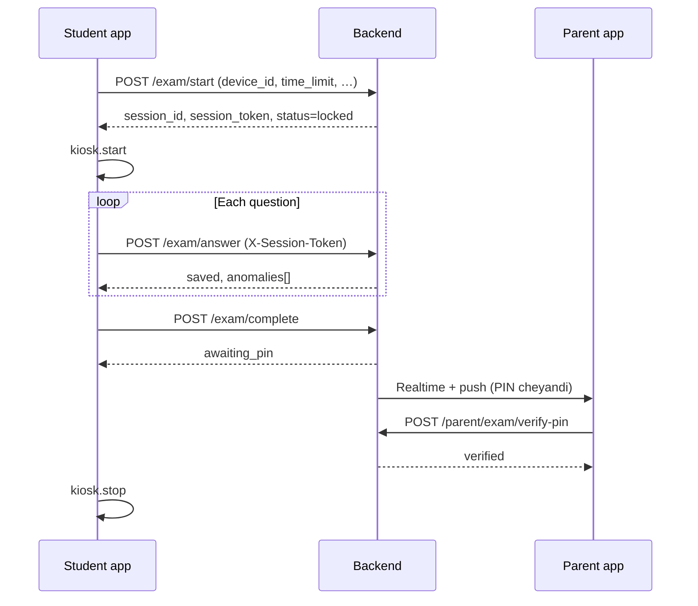

# Kiosk mode & secure exams — student app specification

This document describes how the **student** SOMI / StudyBuddy app should lock down the device during exams so parents can trust live monitoring in **SOMI Connect**. The parent app already consumes `exam_sessions` and anomalies; the student app must emit the right signals.

## Goals

- Prevent leaving the exam UI during an active session (`locked` / `in_progress`).
- Detect obvious cheating signals (impossible answer speed, app backgrounding, device change).
- Hand off to the parent for PIN verification when the session reaches `awaiting_pin`.

## Android — Lock Task Mode

- **Lock Task Mode** (screen pinning / task locking) restricts the user to a single task stack.
- **Implementation**: from a Flutter `MethodChannel`, call `Activity.startLockTask()` when the exam session starts and `stopLockTask()` after PIN-verified completion or explicit abort (per product policy).
- **Requirements**: device owner / approved pinning, or use **managed provisioning** for institutional devices.
- **Pair with**: `SYSTEM_UI_FLAG_IMMERSIVE_STICKY` (via `SystemChrome.setEnabledSystemUIMode`) for fewer accidental exits.

## iOS — Guided Access

- iOS does not expose Lock Task; use **Guided Access** (user- or MDM-enabled) as the supported kiosk pattern.
- **Flutter**: `MethodChannel` to open Settings or show instructions; MDM can push Guided Access profiles for college-owned hardware.
- Document for parents: “Enable Guided Access before handing the device to the student.”

## MethodChannel bridge (recommended contract)

| Method | Args | Behavior |
|--------|------|----------|
| `kiosk.start` | `sessionId` | Start lock task / show GA instructions; register lifecycle listener. |
| `kiosk.stop` | — | End lock task / clear flags. |
| `kiosk.deviceId` | — | Return stable device fingerprint string. |
| `kiosk.isLocked` | — | Return whether app considers kiosk active. |

**Student app** sends `device_id` from `kiosk.deviceId` in `POST /exam/start`. **Backend** stores it on `exam_sessions` and compares on each `POST /exam/answer`.

## Screen recording & overlays

- Android: `MediaProjection` APIs can detect **other apps recording** only in limited ways; prefer **policy** + **anomaly hints** (e.g. sudden GPU/process signals are unreliable on all OEMs).
- Practical approach: log **app pause / inactive** during exam as **medium** anomaly; do not claim “screen recording detected” without OEM-specific APIs.

## App lifecycle monitoring

- Listen to `WidgetsBindingObserver` (`AppLifecycleState`).
- On `paused` / `inactive` while session status is `locked` or `in_progress`, enqueue **APP_EXIT** style anomaly (parent copy already in product spec).
- Debounce to avoid noise from volume dialogs.

## Device fingerprinting

- Combine **ANDROID_ID** / **identifierForVendor** with **model + OS version** hash; not tamper-proof but sufficient to flag **device_switch** when `device_id` changes mid-session.
- Send the same id on every answer; backend compares to session row.

## Exam flow (sequence)

## Backend reference (StudyBuddy)

- `POST /exam/start`, `/exam/answer`, `/exam/complete`, `GET /exam/status/{id}`, `GET /exam/results/{id}` in `backend/exam_controller.py`.
- Anomalies persisted to `anomaly_logs`; parent reads via existing parent APIs / sync.

## Compliance & UX

- Always show **exit** path for emergencies (e.g. parent override call) to avoid trapping minors; product should define **break-glass** (parent phone call, school admin).
- Never claim legal “proof” of cheating; language should stay **behavioral signals**, not accusations.

---

*Phase 3 — generated for SOMI Connect / StudyBuddy integration.*
